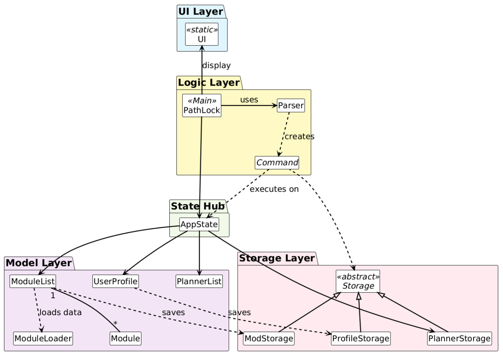
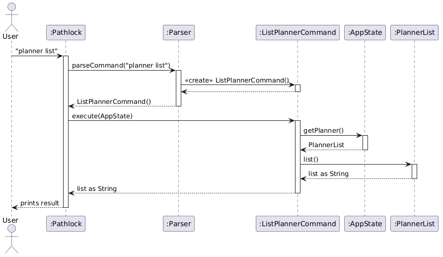

# PathLock Developer Guide

---
## Table of Contents
1. [Acknowledgements](#1-acknowledgements)

2. [Design](#2-design)
    - [Architecture](#architecture)
    - [Command Component](#command-component)

3. [Implementation: Russell](#3-implementation-russell)
    - [Class Structure](#class-structure)
    - [`Storage` Implementation](#storage-implementation)
    - [`ModStorage` Implementation](#module-storage-modstorage)
    - [`ProfileStorage` Implementation](#profile-storage-profilestorage)
    - [`PlannerStorage` Implementation](#planner-storage-plannerstorage)

4. [Implementation: Shi Yong](#4-implementation-shi-yong)
    - [Class Structure](#class-structure-1)
    - [`done` Command Implementation](#done-command-implementation)
    - [`remove` Command Implementation](#remove-command-implementation)
    - [Duplicate Module Check Implementation](#duplicate-module-check-implementation)

5. [Implementation: Brian](#5-implementation-brian)
    - [Class Structure: `list` and `help` Commands](#class-structure-list-and-help-commands)
    - [`list` Commands Implementation](#list-commands-implementation)
    - [`help` Command Implementation](#help-command-implementation)
    - [Class Structure: `UserProfile` and `ProfileStorage`](#class-structure-userprofile-and-profilestorage)
    - [`UserProfile` Implementation](#userprofile-implementation)

6. [Implementation: Ryan](#6-implementation-ryan)
    - [Class Structure](#class-structure-2)
    - [`prereq` Command Implementation](#prereq-command-implementation)
    - [`postreq` Command Implementation](#postreq-command-implementation)
    - [`count` Command Implementation](#count-command-implementation)

7. [Implementation: Kailer](#7-implementation-kailer)
    - [Class Structure](#class-structure-3)
    - [`planner list` Command Implementation](#planner-list-command-implementation)
    - [`planner add` Command Implementation](#planner-add-command-implementation)
    - [`planner remove` Command Implementation](#planner-remove-command-implementation)
    - [`planner edit` Command Implementation](#planner-edit-command-implementation)

8. [Product Scope](#8-product-scope)
    - [Target User Profile](#target-user-profile)
    - [Value Proposition](#value-proposition)

9. [User Stories](#9-user-stories)

10. [Non-Functional Requirements](#10-non-functional-requirements)

11. [Glossary](#11-glossary)

12. [Instructions for Manual Testing](#12-instructions-for-manual-testing)
    - [Launch and First-Time Setup](#launch-and-first-time-setup)
    - [Returning User Login](#returning-user-login)
    - [Marking a Module as Done](#marking-a-module-as-done)
    - [Adding an External Module](#adding-an-external-module)
    - [Removing a Module](#removing-a-module)
    - [Listing Modules](#listing-modules)
    - [Counting MCs](#counting-mcs)
    - [Checking Prerequisites](#checking-prerequisites)
    - [Checking Postrequisites](#checking-postrequisites)
    - [Adding Modules to Planner](#adding-modules-to-planner)
    - [Viewing the Planner](#viewing-the-planner)
    - [Editing Modules in Planner](#editing-modules-in-planner)
    - [Removing Modules from Planner](#removing-modules-from-planner)
    - [Switching Users](#switching-users)
    - [Using the Help Command](#using-the-help-command)
    - [Data Persistence](#data-persistence)
    - [Dealing with Missing or Corrupted Data Files](#dealing-with-missing-or-corrupted-data-files)
    - [Exiting the Program](#exiting-the-program)

---
## 1. Acknowledgements

- [Gson](https://github.com/google/gson) (v2.11.0) — Used for parsing the `modules.json` data file containing CEG module information.
- [JUnit 5 (JUnit Jupiter)](https://junit.org/junit5/) — Used as the testing framework across all
    test files.
- [PlantUML](https://plantuml.com/) — Used to generate all UML class diagrams and sequence diagrams in the Developer Guide.
- This project follows the structure and conventions taught in [CS2113 Software Engineering](https://nus-cs2113-ay2526s2.github.io/website/), including the Command pattern and separation of concerns between Parser, Command, and Storage components.

---
## 2. Design

### Architecture
PathLock is designed using a layered architecture to ensure a clear separation of concerns and maintainability. The application is divided into four main layers: the UI Layer, Logic Layer, Model Layer, and Storage Layer, all coordinated through a central State Hub.


---
### Command Component
**API:** `Command.java`


The `Command` component serves as the backbone of PathLock's execution model. All user actions are routed through a unified command pipeline:

```
User Input → PathLock → Parser → Command → AppState → Domain Component
```

How the `Command` Component work:
1. When the user enters a command, `PathLock` passes the raw input to `Parser`, which identifies the command type and constructs the corresponding `Command` object.
2. Each command is a concrete subclass of the abstract `Command` class, falling into one of four groups:
    - **List Commands** — `ListCompletedCommand`, `ListIncompleteCommand`, `ListNeededCommand`
    - **Module Management Commands** — `DoneCommand`, `RemoveCommand`, `CountCommand`, `PrereqCommand`, `PostreqCommand`
    - **Module Planner Commands** — `AddToPlannerCommand`, `RemoveFromPlannerCommand`, `EditPlannerCommand`, `ListPlannerCommand`, `PlannerSwitchCommand`
    - **PathLock System Commands** — `HelpCommand`, `SwitchUserCommand`
3. `PathLock` calls `execute(appState)` on the returned command. Inside `execute()`, the command retrieves what it needs from `AppState` (via `getModule()`, `getPlanner()`, or `getProfile()`), then delegates the domain logic to the relevant component.
4. Every `execute()` returns a `String` result, which `PathLock` prints to the user.


---
## 3. Implementation: Russell

### Class Structure

The diagrams below show the key classes involved in `Storage` and `ProfileStorage`, and their relationships.


### `Storage` Implementation

#### Overview

The Storage component is responsible for persisting user data to the local file system. It supports three main data types:

- **Profile data** → stored using `ProfileStorage`
- **Completed modules** → stored using `ModStorage`
- **Planner(s)** → stored using `PlannerStorage`

Each storage class extends a common abstraction `Storage<T>`.

---

#### Design

The storage system follows a **generic abstraction pattern**:
```
ModStorage, PlannerStorage and ProfileStorage all implements the smae method from Storage class
```
Key design decisions:

- **Generic base class (`Storage<T>`)** centralises file handling logic (path management, directory creation), avoiding duplication.
- **Specialised subclasses** handle data-specific parsing and formatting.
- **File-based persistence** is used instead of databases for simplicity and offline usage.
- **User-based directory structure** ensures data isolation between users.

#### Implementation

##### Base Class: `Storage<T>`

The abstract `Storage<T>` class provides common functionality shared by all storage implementations.

**Responsibilities**
- Store file path
- Ensure directories and files exist
- Provide abstract methods for subclasses

**Key Methods**
```java
protected File ensureFileExists()
protected File ensureParentDirectoryExists()
public abstract T load() throws IOException
public abstract void save(T data) throws IOException 
```
---

##### Module Storage: `ModStorage`

Stores completed modules for a user.

**File Location**
```
data/users/<username>/modules.txt
```
**Data Format**
```
CS2113|4
CG2111A|4
```

**Load Logic**
1. Ensure file exists
2. Read each line
3. Parse:
    - module code
    - modular credits
4. Create `Module` object
5. Mark module as completed

**Save Logic**
1. Ensure directory exists
2. Write each module as:
```
moduleCode|mc
```

#### Sequence Diagram:
Mod Load:


Mod Save:

---

##### Profile Storage: `ProfileStorage`

Stores user profile information.

**File Location**
```
data/users/<username>/profile.txt 
```
**Data Format**
```
Username|GPA
```

**Load Logic**
1. Check if profile file exists
2. If not, return `null`
3. Read first valid line
4. Parse:
    - name
    - GPA
5. Create `UserProfile` object

**Save Logic**
1. Ensure directory exists
2. Write profile as:
```
Username|GPA
```

#### Sequence Diagram:

save Profile

Load Profile


---

##### Planner Storage: `PlannerStorage`

Stores planned modules and supports multiple planner variations.

**File Location**
```
data/users/<username>/plans/<plannerName>.txt
```
**Default Planner**
```
plan1
```
**Data Format**
```
CS2113|Y2S1|4
CS2040C|Y2S2|4
```

**Load Logic**
1. Ensure file exists
2. Read each line
3. Parse:
    - module code
    - semester
    - modular credits
4. Create `Module` object
5. Add module to `PlannerList`

**Save Logic**
1. Ensure directory exists
2. Write each module as:


**Additional Features**
- `setPlannerName(String plannerName)`
- Allows switching between planner files dynamically

- `listPlannerNames()`
- Returns all planner files in the user's directory

#### Sequence Diagram:

Planner Load:


Planner Save:

---
## 4. Implementation: Shi Yong

### Class Structure

The diagram below shows the key classes involved in the `done` and `remove` commands and their relationship.


### `done` Command Implementation

#### Overview

The `done` command marks a module as completed and records it towards the user's graduation progress.

- **Internal module** (e.g `done CS2113`): the MC value is lookup automatically from the moduel database.
- **External module** (e.g `done GEC1001`): the user must supply the MC count explicitly via `/mc`.

#### Design

The command follows the standard execution pipeline:

```
PathLock (Main) → Parser → DoneCommand → ModuleValidator → ModuleList → Storage
```

Key design decisions:
- **`ModuleValidator`** centralises all input validation (module code format, MC value, MC mismatch), keeping `DoneCommand` focused solely on orchestration.
- **`DoneCommand`** delegates to two private helpers — `handleInternalModule()` and `handleExternalModule()` — to cleanly separate the two execution paths.

#### Implementation

**Parsing**

`parseDone()` checks for the `/mc` flag by splitting on `"/mc"`. If found, the module code and MC integer are extracted separately. If not found, `mc` is passed as `null`. This means `DoneCommand` receives a fully-parsed command object and never needs to interpret raw strings itself.

```java
if (remaining.contains("/mc")) {
    String[] parts = remaining.split("/mc", 2);
    moduleCode = parts[0].trim();
    mc = Integer.parseInt(parts[1].trim());
} else {
    moduleCode = remaining;
}
```

**Execution**

1. `ModuleValidator.validateModuleCode()` rejects codes that do not match the NUS format (2–4 letters + 4 digits + optional letter).
2. `isRecognisedModule()` determines whether to take the internal or external path.
3. Both paths call `Storage.save(modules.getCompletedModules())` as the final step to persist the change.

#### Sequence Diagram

The diagram below shows the internal module path (`done CS2113`):


The diagram below shows the external module path (`done GEC1001 /mc 4`):


#### Why This Design?

The split into `handleInternalModule()` and `handleExternalModule()` avoids a deeply nested `if/else` block inside `execute()`. Each helper has a clear, single responsibility — easy to read, test, and extend independently.

Delegating validation to `ModuleValidator` means that if the NUS module code format ever changes, only one class needs updating.

---
### `remove` Command Implementation

#### Overview

The `remove` command undoes a previously recorded completion. For example, `remove CS2113` resets `CS2113` back to incomplete and removes it from the saved progress. It supports both internal and external modules.

#### Design

```
PathLock (Main) → Parser → RemoveCommand → ModuleList → Storage
```

`RemoveCommand` is deliberately thin. It calls `modules.removeModule()`, always saves, and returns a result string. No validation class is needed because `Parser` already ensures the module code is non-empty.

`removeModule()` does **not** delete any `Module` object. For internal modules, it calls `module.markIncompleted()` — reverting status to `INCOMPLETE`. This preserves the integrity of the `allModules` map, which is used by all other commands.

#### Sequence Diagram
The diagram below shows remove module path (`remove CS2113`):


#### Why This Design?

Using `markIncompleted()` rather than deleting the `Module` object keeps the `allModules` map intact. This map is the shared database for `isRecognisedModule()`, `getMcForModule()`, and `listNeededModules()` — all of which depend on all modules being present regardless of completion status.

---
### Duplicate Module Check Implementation

#### Overview

The duplicate module check prevents a user from recording the same module as completed more than once. It is enforced inside `ModuleList` for both internal and external modules, and surfaces to the user as:
`"Module <code> has already been completed"`.

#### Sequence Diagram
The diagram below shows duplicate module check path:


---
## 5. Implementation: Brian

### Class Structure: `list` and `help` Commands

The diagram below shows the key classes involved in the `list` commands and the `help` command, and their relationships.


### `list` Commands Implementation

#### Overview

The three list commands provide different filtered views of the module list:

- `list completed` — shows all modules the user has marked as done.
- `list incomplete` — shows all required CEG modules not yet completed, including OR-group modules (e.g. `CS2103 OR CS2113`).
- `list needed` — shows every required module for graduation.

All three commands are **read-only** — they do not modify any data or write to storage.

#### Design

All three commands follow the same execution pipeline:

```
PathLock (Main) → Parser → ListCommand → AppState → ModuleList → returns String
```

Key design decisions:
- All three commands are **thin wrappers** — each one extracts `ModuleList` from `AppState` and delegates to a single method on `ModuleList`. The formatting and filtering logic lives entirely in `ModuleList`, keeping the command classes focused solely on retrieval.
- Using **three separate command classes** (rather than a single `ListCommand` with a flag) keeps each class independently testable and avoids branching logic inside `execute()`.
- `listIncompleteModules()` and `listNeededModules()` handle **OR groups** by tracking which `orGroup` labels have already been listed, preventing duplicates when multiple modules share the same OR group.

#### Implementation

**Parsing**

`Parser.parseCommand()` performs exact string matching for the three list commands:

```java
if (input.equals("list completed")) {
    return new ListCompletedCommand();
}
if (input.equals("list incomplete")) {
    return new ListIncompleteCommand();
}
if (input.equals("list needed")) {
    return new ListNeededCommand();
}
```

**Execution**

Each command's `execute()` follows the same pattern:

```java
@Override
public String execute(AppState appState) {
    ModuleList modules = appState.getModule();
    assert modules != null : "ModuleList should not be null";
    String result = modules.listCompletedModules(); // or listIncompleteModules() / listNeededModules()
    return result;
}
```
Inside `ModuleList`:

- `listCompletedModules()` iterates over both `allModules` and `externalModules`, collecting entries where `module.isCompleted()` is true, then formats them as a numbered list.
- `listIncompleteModules()` iterates over `allModules`, skipping OR groups already listed and modules already completed. It uses `isOrGroupFulfilled()` to check if any member of an OR group has been completed before listing the group.
- `listNeededModules()` iterates over `allModules` and lists every module or OR group without filtering by completion status.

#### Sequence Diagram

The diagrams below shows the execution path for `list completed`, `list incomplete` and `list needed`.


#### Why This Design?

Delegating all formatting logic to `ModuleList` means the three command classes stay extremely lightweight and identical in structure. If the output format ever needs to change (e.g. adding MC counts next to each module), only `ModuleList` needs updating — not three separate command classes.

---
### `help` Command Implementation

#### Overview

The `help` command gives users two views:
- `help` (no argument) — prints a grouped overview of all available commands.
- `help <command>` (with argument) — prints a detailed breakdown of a specific command, including its purpose, usage format, and example output.

#### Design

```
PathLock (Main) → Parser → HelpCommand → returns String
```

`HelpCommand` does not interact with `AppState` or `ModuleList` for its core logic. All help content is inside `HelpCommand` itself via `buildHelpMap()`. 

Key design decisions:
- **`buildHelpMap()`** stores all detailed help strings in a `LinkedHashMap<String, String>`, keyed by normalised topic name. This separates content from lookup logic, making it easy to add new commands to the help system without changing control flow.
- **`normaliseTopic()`** handles variations in how users might type command names (e.g. extra spaces, mixed case), mapping them to a canonical key before querying the map.

#### Implementation

**Parsing**

```java
if (input.equals("help")) {
    return new HelpCommand(); // no argument constructor, topic = null
}
if (input.startsWith("help ")) {
    String topic = input.substring(5).trim();
    return new HelpCommand(topic); // topic argument constructor
}
```

**Execution**

```java
@Override
public String execute(AppState appState) {
    if (topic == null || topic.isEmpty()) {
        return showGeneralHelp();
    }
    return showDetailedHelp(topic);
}
```

`showGeneralHelp()` builds and returns a fixed formatted string grouping all commands by category (List Commands, Module Management, Module Planner, PathLock System).

`showDetailedHelp()` calls `normaliseTopic()` on the input, then looks up the result in `buildHelpMap()`. If no match is found, it returns a fallback message directing the user to `help`.

```java
private String showDetailedHelp(String inputTopic) {
    Map<String, String> helpMap = buildHelpMap();
    String normalisedTopic = normaliseTopic(inputTopic);
    if (helpMap.containsKey(normalisedTopic)) {
        return helpMap.get(normalisedTopic);
    }
    return dash + "\nNo detailed help found for \"" + inputTopic + "\".\n"
            + "Type 'help' to see all available commands.\n" + dash;
}
```

#### Sequence Diagram

The diagram below shows the execution path for `help`:


The diagram below shows the execution path for `help done`:


#### Why This Design?

Storing all help content in `buildHelpMap()` as a `LinkedHashMap` means that adding a new command to the help system requires only one change, a new entry in the map, without touching control flow or the general help string separately.

`normaliseTopic()` acting as a pre-processing step keeps `showDetailedHelp()` clean. If future commands have aliases or shorthand (e.g. `lc` for `list completed`), `normaliseTopic()` is the only place that needs updating.

---
### Class Structure: `UserProfile` and `ProfileStorage`

The diagram below show the key classes involved in `UserProfile` and `ProfileStorage`.


### `UserProfile` Implementation

#### Overview

The `UserProfile` class stores the user's name and GPA, and uses the GPA to derive a recommended maximum semester workload in MCs. This profile is created once at startup, either loaded from file via `ProfileStorage`, or created fresh from user input.

Each user profile is stored at:
`data/users/<username>_profile.txt`

Format:
`NAME|GPA`

Example:
`Alice|4.50`

#### Design

The profile creation and workload recommendation flow follows this pipeline:
```
PathLock (Main) → getOrCreateProfile() → ProfileStorage.loadProfile() → UserProfile
                                       ↘ (if not found) prompt user → UserProfile → ProfileStorage.saveProfile()
```

#### Implementation

**Construction**
```java
public UserProfile(String name, double gpa) {
    if (name == null || name.trim().isEmpty()) {
        throw new IllegalArgumentException("Name cannot be empty.");
    }
    if (gpa < 2.0 || gpa > 5.0) {
        throw new IllegalArgumentException("GPA must be between 2.0 and 5.0.");
    }
    this.name = name.trim();
    this.gpa = gpa;
}
```

**Recommended Max Workload**
```java
public int getRecommendedMaxWorkload()
```

Maps the user's GPA to a recommended MC maximum workload per semester:

| GPA Range     | Recommended Max Workload |
|---------------|--------------------------|
| 4.5 and above | 32 MCs                   |
| 4.0 – 4.49    | 28 MCs                   |
| 3.0 – 3.99    | 26 MCs                   |
| Below 3.0     | 24 MCs                   |

> **Note:** For students in their first semester of study, acknowledging that their GPA is 0.00, the system also allows for their input, which will automatically assign their workload to a maximum default of 20 MCs.

The module is always added. The warnings inform rather than block, keeping the user in full control of their planner.

#### Sequence Diagram


#### Why This Design?
- GPA validation at construction time prevents invalid state from continuing through the app
- Centralising the GPA-to-workload mapping in `UserProfile` means the thresholds only need updating in one place

---
## 6. Implementation: Ryan

### Class Structure

The diagram below shows the key classes involved in the `prereq`, `postreq`, and `count` commands and their relationships.

![Class diagram of prereq, postreq and count commands](https://www.plantuml.com/plantuml/png/hLLTR-eu47tdLunuMTXxgUvzsOUeMvNIQhSI7sYXRvKgrnd0gcEdzaJgBjl_VcqJOqYGIgNoajXpVCwPoNW0kBR435M5x02G88amainQk1LiRLYHGMdGuEjtABMbyC9K3bnNYc2aYyAlmWcqdGx0HkG84vrN4XV4gB9G86rqRcEC2yCbkfLz4QfaJWAuFpuaCkAv8hpdMYt4VmW_F5-8GNVBdfqwu_J-g6hLBZ2xTx3jGFXz0tn3xbXwh2oz0SnWMB_rCrWu3RLssFV4FMV6eaaCM-l0Whz3wGErGCzvhIWIzBCetA0AfMfw6kmPfLwlqMGm3iyOBdord52EaJzQEUBhjN7z2FnqqYF__JvfzFCgSstfQmiI2R--8Z4SNKORMTtDOs4fag-HTfkzVYES20_spqqyXPUpvN3yzDS_mzk7uV9-DdsQZ1OP24Nm9_pyuqVqmQJSgLXdWvMNkxo-rz9NaHRV28rYvs1zQhkkguGLXFPKZUDBgnpsGKdDNp2_-VUSSs68JBZjfSY92gRgyNP730eUwXANvQ7t37prwqptrR1XB6L7GwgLYVUTR3N3p8mCveA2ywJUBbx_f8LlmheEBYKIvXxohBL4fcBogAe2kbl_GCD8QEM6tg7RCFaED_Obkf-EPfFv-6vvLs_4vMszde-7q-b-zJ1Dwo0TR-hb_uF1yJHh1jC0QSKQrzxnnXbxSN7Lc94PS8ECq1w30li7cAZIGdMW8UBGwNfdu62vXPNHHGUYqiV0AFSHzBHy6WRUA9FIFgfsjxJzd3wPBauqTfPQ-vBsdTkKnc3GEBhHqlzn7svsVtO3hljxjzxs4beH4of18M2EUzJHiV1nb7PQ4bS4UdL0dMKnhKvePVBDZnPkPik_8Ksw4FI9DgOQa0uXqiGay7Y_O3Ao5-5IvK5uRy28zQRbu5IH0kk2CsMz2oXgEQ5EcU8Rv2yMaF4DQ8M_xI97Kmcah-DA6w0DXl1hXKPW3dw-DRrUkqLLo5y0)

### `prereq` Command Implementation

#### Overview

The `prereq` command displays the prerequisites needed before taking a specified module. For example, `prereq CS2113` shows that CS2040C must be completed before taking CS2113.

#### Design

The command follows the standard execution pipeline:

```
PathLock (Main) → Parser → PrereqCommand → AppState → ModuleList → Module
```

Key design decisions:
- **`PrereqCommand`** delegates all prerequisite lookup logic to `ModuleList.getPrerequisites()`, keeping the command focused solely on orchestration.
- The module code is normalised to uppercase in the constructor, ensuring case-insensitive matching throughout.

#### Implementation

**Parsing**

`Parser.parseCommand()` checks for the `prereq ` prefix. If the input is bare `prereq` with no module code, a `MissingCommandException` is thrown. Otherwise, the module code is extracted from the input (everything after the prefix, trimmed) and passed to the `PrereqCommand` constructor.

**Execution**

1. `PrereqCommand.execute()` retrieves `ModuleList` from `AppState`.
2. `ModuleList.getPrerequisites()` looks up the module in `allModules` and calls `Module.getPrerequisites()` to get the prerequisite list.
3. If the module is not recognised, a message is returned. If recognised but has no prerequisites, a different message is returned.

#### Sequence Diagram

The diagram below shows the execution path for `prereq CS2113`:


#### Why This Design?

`PrereqCommand` is deliberately thin — it retrieves `ModuleList` from `AppState` and delegates entirely to `getPrerequisites()`. This keeps prerequisite lookup logic in one place (`ModuleList`), making it easy to test and modify without touching the command class.

---
### `postreq` Command Implementation

#### Overview

The `postreq` command displays the modules unlocked by completing a specified module. For example, `postreq CS1010` shows all modules that list CS1010 as a prerequisite.

#### Design

```
PathLock (Main) → Parser → PostreqCommand → AppState → ModuleList
```

Key design decisions:
- **`PostreqCommand`** follows the same pattern as `PrereqCommand` for consistency.
- `ModuleList.getModulesUnlockedBy()` iterates through all modules and checks if the given module code appears in each module's prerequisite list. This is a reverse lookup compared to `getPrerequisites()`.

#### Implementation

**Parsing**

Identical pattern to `prereq` — checks for the `postreq ` prefix and throws `MissingCommandException` if no module code is provided.

**Execution**

1. `PostreqCommand.execute()` retrieves `ModuleList` from `AppState`.
2. `ModuleList.getModulesUnlockedBy()` iterates through every module in `allModules`, checking if the target module code appears in each module's prerequisite list.
3. Matching modules are collected and returned as a formatted string.

#### Sequence Diagram

The diagram below shows the execution path for `postreq CS1010`:


#### Why This Design?

The split into separate `PrereqCommand` and `PostreqCommand` classes (rather than a single command with a flag) follows the Single Responsibility Principle. Each command has one clear purpose and can be tested independently. The reverse lookup in `getModulesUnlockedBy()` avoids the need for a separate "post-requisite" data structure — it reuses the existing prerequisite data by searching in the opposite direction.

---
### `count` Command Implementation

#### Overview

The `count` command displays the user's MC progress towards the 160 MCs required for CEG graduation. It shows completed MCs, remaining MCs, and percentage progress.

#### Design

```
PathLock (Main) → Parser → CountCommand → AppState → ModuleList
```

`CountCommand` is the simplest of the three commands — it has no fields (unlike `PrereqCommand` and `PostreqCommand` which store a module code). It retrieves `ModuleList` from `AppState` and delegates entirely to `ModuleList.countMcs()`.

#### Implementation

**Parsing**

`Parser.parseCommand()` performs an exact match on the string `"count"` and returns a new `CountCommand` with no arguments.

**Execution**

`CountCommand.execute()` retrieves `ModuleList` from `AppState` and calls `countMcs()`, which iterates over all completed modules (both internal and external), sums their MC values, and returns a formatted progress string.

#### Sequence Diagram

The diagram below shows the execution path for `count`:


#### Why This Design?

`CountCommand` has no fields and no branching — it is a single delegation to `ModuleList.countMcs()`. This keeps the command class minimal and puts all MC calculation logic in `ModuleList`, consistent with how `PrereqCommand` and `PostreqCommand` delegate to `ModuleList` for their respective lookups.

---
## 7. Implementation: Kailer
### Class Structure

The diagrams below show the key classes involved in the planner feature and their relationships

`planner list`<br>


`planner add`<br>


`planner remove`<br>


`planner edit`<br>


### `planner list` Command Implementation

#### Overview
The `planner list` command displays all the mods the user has added into the planner in order of semesters.

#### Design

The command follows the standard execution pipeline:
```
PathLock (Main) → Parser → ListPlannerCommand → AppState → PlannerList
```

It then loops through the 2D array `course` stored in PlannerList and prints the moduleCode out.A

#### Implementation

**Parsing**

`Parser.parseCommand()` checks for the `planner` then `list`

**Execution**

1. `ListPlannerCommand.execute()` retrieves `PlannerList` from `AppState`.
2. Returns `PlannerList.list()`
3. `PlannerList.list()`
4. The planner stores its modules in `course`, an `ArrayList` of size 8, where each index corresponds to a semester.
5. The method creates a `StringBuilder` named `output` to build the final string efficiently.
6. It iterates through `course` sequentially from index `0` to `7`, ensuring that semesters are listed in order.
7. For each semester, the method first appends a semester header in the format `Semester: X`, where `X` ranges from `1` to `8`.
8. It then retrieves the `ArrayList<Module>` corresponding to that semester.
9. The method iterates through all `Module` objects stored in that semester and appends each module’s code on its own line.
10. After all 8 semesters have been processed, the method returns the constructed string.
11. Even if a semester does not contain any modules, its header is still displayed. This ensures that the planner structure remains explicit and consistently formatted for the user.

#### Sequence Diagram

The diagram below shows the sequence of action upon the user inputting `planner list`


---
### `planner add` Command Implementation

#### Overview

The `planner add` command allows the User to add modules to the planner which can then be show with `planner list`

#### Design
```
PathLock (Main) → Parser → AddToPlannerCommand → AppState → PlannerList
```

Key design decisions:
- PlannerList is a separate list from ModuleList as whether a mod is plan or unplanned is independent on whether the User has completed the mod or not
- PlannerList uses a 2D arrayList to allow for easy insertion and removal of mods across all 8 semesters

#### Implementation

**Parsing**
`Parser.parseCommand()` checks for the `planner` then `add`. If subsequent input is bare a `MissingCommandException` is thrown. Otherwise, the module code and semester is extracted and passed to the `AddToPlannerCommand` constructor.

**Execution**
1. `AddToPlannerCommand.execute()` retrieves `ModuleList` and `PlannerList` from `Appstate`
2. `moduleList.getModule(moduleCode)` retrieves Module based of `moduleCode`
3. If module null, means moduleCode does not exist, `IllegalArgumentException` is thrown
4. It sets `Module` semester attribute, if semester is of incorrect format `IllegalArgumentException` is thrown
5. Executes `PlannerList.addModule(module)`
6. It extracts semester, and inserts it into the respective array index of course

#### Sequence Diagram

The diagram below shows the sequence of action upon the user inputting `planner add cs2113 y2s2`


---
### `planner remove` Command Implementation
#### Overview
The `planner remove` command allows the User to remove the modules that are in the planner should they not want it

#### Design
```
PathLock (Main) → Parser → RemoveFromPlannerCommand → AppState → PlannerList
```

Key design decisions:
- `planner remove` does not care if moduleCode exists or not as for it to be added to planner it should exist based on `planner add` implementation

#### Implementation

**Parsing**
`Parser.parseCommand()` checks for the `planner` then `remove`. If subsequent input is bare a `MissingCommandException` is thrown. Otherwise, the module code is extracted and passed to the `RemoveFromPlannerCommand` constructor.

**Execution**
1. `RemoveFromPlanner.execute()` retrieves `PlannerList` from `AppState`
2. Sweeps through every `Module` in `course` and retrieves their `ModuleCode`
3. If it matches, `Module` is removed
4. If no matches found, `NoSuchElementException` is thrown

#### Sequence Diagram

The diagram below shows the sequence of action upon the user inputting `planner remove cs2113`


---
### `planner edit` Command Implementation
#### Overview
The `planner edit` command allows the User to make changes to what semester they plan to take a module.

#### Design
```
PathLock (Main) → Parser → EditPlannerCommand → AppState → PlannerList
```
Key design decisions:
- `planner edit` removes the current module, changes the `semester` attribute then reinserts it
- This is done to help update the position of the module with respect to the course arrayList

#### Implementation
**Parsing**
`Parser.parseCommand()` checks for the `planner` then `edit`. If subsequent input is bare a `MissingCommandException` is thrown. Otherwise, the module code and semester is extracted and passed to the `EditPlannerCommand` constructor.

**Execution**
1. `EditPlannerCommand.execute()` retrieves `ModuleList` and `PlannerList` from `AppState`
2. `moduleList.getModule(moduleCode)` retrieves Module based of `moduleCode`
3. If module null, means moduleCode does not exist, `IllegalArgumentException` is thrown
4. Sets module's `semester` to inputted semester, if semester is in wrong format `IllegalArgumentException` is thrown 
5. Executes `PlannerList.removeModule(moduleCode)` (see `planner remove` for execution)
6. Executes `PlannerList.addModule(module)` (see `planner add` for execution)

#### Sequence Diagram

The diagram below shows the sequence of action upon the user inputting `planner edit cs2113 y2s2`


---
## 8. Product scope
### Target user profile
- Y1-Y4 Computer Engineering Undergraduate Students (JC path)
- did not follow the recommended TimeTable
- has a need to manage complex multi-year university pathways
- can type fast
- is reasonably comfortable using CLI apps

### Value proposition

PathLock provides a lightweight, offline CLI tool for CEG students to organise complex multi-year university pathways,
tracking completed modules, monitoring MC progress, and managing graduation requirements without needing a
database or internet connection.

---
## 9. User Stories

| Version | As a ...               | I want to ...                                            | So that I can ...                                                    |
|---------|------------------------|----------------------------------------------------------|----------------------------------------------------------------------|
| v1.0    | new user               | see usage instructions                                   | refer to them when I forget how to use the application               |
| v1.0    | CEG student            | mark a module as completed                               | track my academic progress                                           |
| v1.0    | CEG student            | remove a completed module                                | correct mistakes in my records                                       |
| v1.0    | CEG student            | list all completed modules                               | see what I have already cleared                                      |
| v1.0    | CEG student            | list all incomplete modules                              | know what I still need to take                                       |
| v1.0    | CEG student            | list all modules required for graduation                 | see the full graduation checklist                                    |
| v1.0    | CEG student            | count my completed MCs                                   | track how far I am from the 160 MC requirement                       |
| v1.0    | CEG student            | check prerequisites for a module                         | know what I need to clear before taking it                           |
| v1.0    | CEG student            | check what modules a completed module unlocks            | plan what to take next                                               |
| v1.0    | CEG student            | have my completed modules saved automatically            | retain my progress between sessions                                  |
| v2.0    | CEG student            | add modules to a semester planner                        | plan which modules I want to take each semester                      |
| v2.0    | CEG student            | view my planner across all 8 semesters                   | see my whole planned timetable over the course                       |
| v2.0    | CEG student            | move a module to a different semester in the planner      | correct or adjust my plan                                            |
| v2.0    | CEG student            | remove a module from the planner                         | update my plan when things change                                    |
| v2.0    | CEG student            | see workload warnings when adding to the planner         | avoid overloading or underloading a semester                         |
| v2.0    | CEG student            | add external modules with custom MCs                     | track exchange or cross-faculty modules                              |
| v2.0    | CEG student            | create a profile with my GPA                             | get personalised workload recommendations                           |
| v2.0    | CEG student            | switch between user profiles                             | share the app with friends or manage multiple plans                  |
| v2.0    | CEG student            | get detailed help on specific commands                   | learn how to use each feature without external docs                  |
| v2.0    | CEG student            | have my planner saved and loaded automatically           | retain my semester plan between sessions                             |

---
## 10. Non-Functional Requirements

1. Should work on any mainstream OS (Windows, macOS, Linux) with Java 17 or above installed.
2. All data is stored locally and the application should work fully without internet connectivity.
3. The saved data files (modules, planner, profile) should remain human-readable and editable with a standard text editor.
4. Should respond to any command within 1 second on a typical machine.
5. A user with average typing speed should be able to complete module tracking tasks faster than using a GUI app.
6. The application should handle invalid inputs gracefully without crashing.
7. The codebase should follow object-oriented design principles taught in CS2113.

---
## 11. Glossary

* **Module** — A university course unit identified by a code (e.g. CS2113). Each module carries a fixed number of Modular Credits.
* **MC (Modular Credits)** — A measure of the workload of a module. CEG students must complete 160 MCs to graduate.
* **CEG** — Computer Engineering, an undergraduate programme offered jointly by the School of Computing and the Faculty of Engineering at NUS.
* **Prerequisite** — A module that must be completed before a student is allowed to take another module (e.g. CS2040C is a prerequisite for CS2113).
* **Postrequisite** — A module that is unlocked after completing a given module (the reverse of a prerequisite).
* **Preclusion** — A module that cannot be taken if another equivalent module has already been completed (e.g. CS1010 and CS1010E are preclusions of each other).
* **OR Group** — A set of modules where completing any one satisfies a graduation requirement (e.g. the capstone group: CG4001 or CG4002).
* **Planner** — The 8-semester planning view (Y1S1 to Y4S2) where students can assign modules to future semesters.
* **Workload** — The total MCs assigned to a single semester in the planner. PathLock warns if a semester's workload exceeds the GPA-based recommended maximum or falls below the 18 MC minimum.
* **User Profile** — A saved record containing the user's name and GPA, used to personalise workload recommendations.
* **Internal Module** — A module that is in PathLock's built-in CEG module list.
* **External Module** — A module not in PathLock's built-in CEG module list (e.g. cross-faculty modules), added manually with a user-specified MC value.

---

## 12. Instructions for manual testing

Given below are instructions to test the app manually. These instructions provide a starting point;
testers are expected to do more exploratory testing.

### Launch and first-time setup

1. Ensure Java 17 or above is installed.
2. Download `pathlock.jar` from the latest release.
3. Open a terminal, navigate to the folder containing the JAR, and run: `java -jar pathlock.jar`
4. Expected: ASCII logo is displayed, followed by `Enter your name:` prompt.
5. Enter a name (e.g. `TestUser`) and press Enter.
6. Expected: Prompted for GPA with `Enter your GPA (2.0 to 5.0):`.
7. Enter a valid GPA (e.g. `3.5`) and press Enter.
8. Expected: Profile saved confirmation and recommended max workload displayed. `Pathlock awaits:` prompt appears.

**Edge cases to try:**
- Empty name → should re-prompt.
- GPA outside range (e.g. `1.0`, `6.0`) → should re-prompt.
- Non-numeric GPA (e.g. `abc`) → should re-prompt.

### Returning user login

Prerequisites: A profile for `TestUser` was created in a previous session.

1. Launch the app and enter `TestUser` at the name prompt.
2. Expected: `Welcome back, TestUser!` with saved GPA and workload displayed. No GPA prompt.

### Marking a module as done

1. Test case: `done CS1010`
   - Expected: `CS1010 has been added.`

2. Test case: `done CS1010` (duplicate)
   - Expected: Error message indicating module already completed.

3. Test case: `done INVALID`
   - Expected: Error about invalid module code format.

4. Test case: `done` (missing module code)
   - Expected: Error prompting user to input module code.

### Adding an external module

1. Test case: `done EX1234 /mc 4`
   - Expected: `EX1234 has been added.`

2. Test case: `done EX5678` (external module without `/mc`)
   - Expected: Message prompting user to provide MCs using `/mc`.

3. Test case: `done EX9999 /mc 0`
   - Expected: Error that MC must be a positive integer.

4. Test case: `done EX9999 /mc 13`
   - Expected: Error that MC cannot be greater than 12.

### Removing a module

Prerequisites: `CS1010` has been marked as done.

1. Test case: `remove CS1010`
   - Expected: `CS1010 has been removed`

2. Test case: `remove CS9999`
   - Expected: Message indicating module is not in the list.

3. Test case: `remove` (missing module code)
   - Expected: Error prompting user to input module code.

### Listing modules

1. Test case: `list completed`
   - Expected: Shows all completed modules, or `No modules completed yet.` if none.

2. Test case: `list incomplete`
   - Expected: Shows incomplete modules with OR groups displayed as `CS2103 OR CS2113`.

3. Test case: `list needed`
   - Expected: Shows all modules required for graduation.

### Counting MCs

Prerequisites: At least one module marked as done.

1. Test case: `count`
   - Expected: Shows `Completed: X / 160 MCs (Y%)` and `Incomplete: Z MCs (W%)`.

### Checking prerequisites

1. Test case: `prereq CS2113`
   - Expected: `Prerequisites for CS2113: CS2040C`

2. Test case: `prereq CS1010`
   - Expected: `CS1010 has no prerequisites.`

3. Test case: `prereq` (missing module code)
   - Expected: Error prompting user to input module code.

### Checking postrequisites

1. Test case: `postreq CS1010`
   - Expected: Lists modules that CS1010 unlocks (e.g. CS2040C).

2. Test case: `postreq CG4002`
   - Expected: Message indicating module does not unlock any other modules.

### Adding modules to planner

Prerequisites: No modules in the planner yet.

1. Test case: `planner add CS1010 y1s1`
   - Expected: Confirmation message with workload information for Y1S1.

2. Test case: `planner add CS1010 y1s2` (duplicate module)
   - Expected: Error indicating module is already in the planner.

3. Test case: `planner add CS1010 y5s1` (invalid semester)
   - Expected: Error about incorrect semester format.

4. Test case: `planner add FAKE1234 y1s1` (module not in module list)
   - Expected: Error indicating module not found.

### Viewing the planner

1. Test case: `planner list`
   - Expected: Shows all 8 semesters (Y1S1 to Y4S2) with modules listed under each.

### Editing modules in planner

Prerequisites: `CS1010` is in the planner under Y1S1.

1. Test case: `planner edit CS1010 y2s1`
   - Expected: `Edited CS1010 to be in y2s1`

2. Test case: `planner edit CS9999 y2s1` (module not in planner)
   - Expected: Error message.

### Removing modules from planner

Prerequisites: `CS1010` is in the planner.

1. Test case: `planner remove CS1010`
   - Expected: `CS1010 has been removed from planner`

2. Test case: `planner remove CS9999` (not in planner)
   - Expected: Error message.

### Switching users

Prerequisites: A profile for `AnotherUser` exists (created in a previous session).

1. Test case: `switch AnotherUser`
   - Expected: `Switched to user: AnotherUser` with that user's modules and planner loaded.

2. Test case: `switch NonExistentUser`
   - Expected: `User "NonExistentUser" does not exist.`

### Using the help command

1. Test case: `help`
   - Expected: Grouped overview of all available commands.

2. Test case: `help done`
   - Expected: Detailed help for the `done` command with format and examples.

3. Test case: `help invalidtopic`
   - Expected: `No detailed help found for "invalidtopic".`

### Data persistence

1. Add some modules (`done CS1010`, `done CS2040C`), add to planner (`planner add CS1010 y1s1`), then type `exit`.
2. Relaunch the app and log in with the same username.
3. Run `list completed` and `planner list`.
   - Expected: All previously saved modules and planner state are restored.

### Dealing with missing or corrupted data files

1. Navigate to `data/users/<username>/` and delete `modules.txt`.
   - Expected: App starts with an empty module list. No crash.

2. Open `modules.txt` and add a malformed line (e.g. `BADDATA`).
   - Expected: App skips the malformed line and loads remaining valid entries.

3. Delete the entire `data/` directory.
   - Expected: App treats user as a new user and prompts for GPA.

### Exiting the program

1. Test case: `exit`
   - Expected: Closing message displayed, application terminates.
